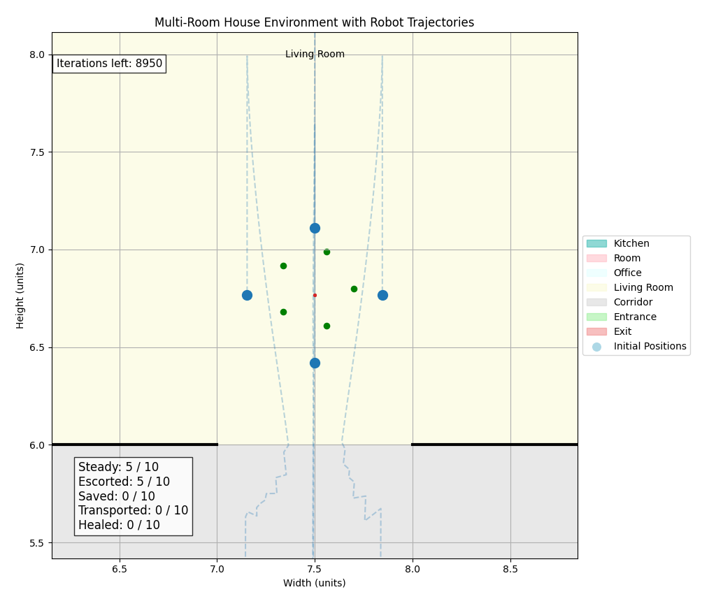
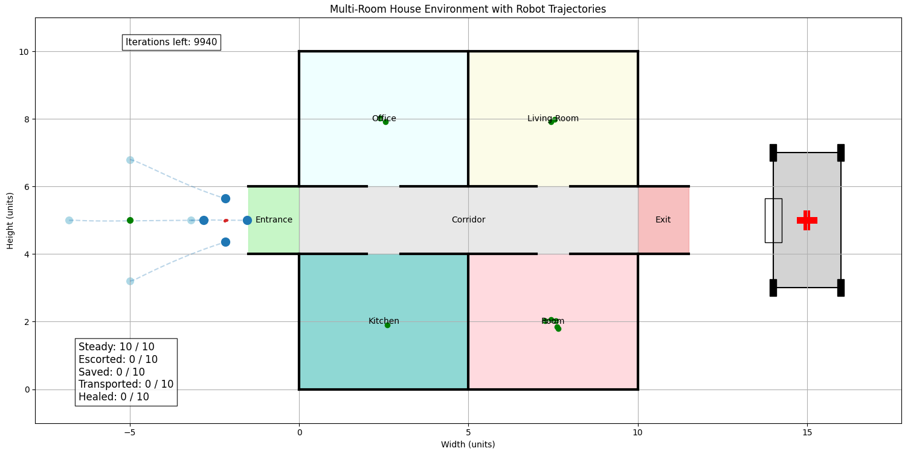

# Distributed Multi-Robot Search and Rescue Operations Using Aggregative Optimization in a Multi-Room House Environment

[](https://www.python.org/)  
Search and Rescue simulation using distributed BDI agents with aggregative optimization in a multi-room house environment.

---

## 🧠 About the Project

This project simulates a team of autonomous robots performing **search and rescue (SAR)** operations using a distributed **Belief-Desire-Intention (BDI)** framework. Each robot operates as a decentralized agent, coordinating with others via **gradient tracking** and **consensus algorithms** to:

- Explore rooms collaboratively
- Locate and escort survivors
- Avoid obstacles with potential fields
- Transport rescued individuals to safety via an autonomous ambulance

Agents dynamically adjust plans, form circular formations, and adapt based on environment state — ideal for critical missions in unknown or damaged indoor areas.

---

## 🗂 Project Structure

```
📦 multi-robot-sar
┣ 📜 Andrea_Perna3_MAS_Project.py                  # Main simulation script
┣ 📜 Andrea_Perna3_MAS_Parameters.yaml             # Config file with tunable parameters
┣ 📜 Andrea_Perna3_MAS_Rooms.txt                   # Environment layout
┣ 📜 README.md                       # You are here!
┣ 📄 Andrea_Perna3_MAS_Report.pdf   # Full technical report
┣ 📄 Andrea_Perna3_MAS_Abstract.pdf # Abstract
┗ 📊 Andrea_Perna3_MAS_Presentation.pptx # Presentation
┣ 📁 images
┃ ┣ 🖼️ static_view.png
┃ ┣ 🖼️ dynamic_view.mp4
┣ ┣ 🖼️ cost_evolution.mp4
┣ 📁 videos
┃ ┣ 🎞️ Animation_Dynamic_View.mp4
┃ ┣ 🎞️ Animation_Static_View.mp4
┃ ┗ 🎞️ Computation.mp4
```

---

## 🛠 How to Run

1. Make sure all files are in the same folder.
2. Run the main simulation with:

```bash
python MAS_Project.py
```

🧠 **Note:** During execution, several visualizations and plots will appear. Close each one to proceed to the next step.

---

## ⚙️ Configuration

All parameters are defined in `MAS_Parameters.yaml`.

| Parameter               | Type | Notes |
|------------------------|------|-------|
| `NN`                   | T    | Number of agents |
| `n_survivors`          | T    | Number of survivors |
| `max_survivors_escort` | CT   | Affects agent capacity during escort |
| `step_size`            | T    | Controls agents' speed |
| `view_type`            | T    | `'static'` or `'dynamic'` visualization |

### Parameter Categories:
- 🟢 **T (Tunable):** Safe to adjust
- 🟡 **CT (Careful):** May affect system behavior
- 🔴 **NT (Non-tunable):** Critical – do not change

---

## 📊 Output

The simulation generates:
- Real-time house and agent visualizations
- BDI-based decision-making logs
- Cost function convergence and barycenter error plots
- Animated SAR mission (MP4)

### 🖼️ Project Snapshots
- #### 🔄 Dynamic View


#### 🧭 Static View


### 📽️ Project Videos

- 📹 [Dynamic View Animation](./videos/Animation_Dynamic_View.mp4)
- 📹 [Static View Animation](./videos/Animation_Static_View.mp4)
- 🧮 [Computation Process Visualization](./videos/Computation.mp4)

📌 *Note: Videos are downloadable. GitHub doesn’t support direct streaming of `.mp4` files.*

---

## 📎 Resources

- [📘 Full Report (PDF)](./Andrea_Perna3_MAS_Report.pdf)
- [📄 Abstract (PDF)](./Andrea_Perna3_MAS_Abstract.pdf)
- [🎞️ Presentation (PDF)](./Andrea_Perna3_MAS_Presentation.pdf)

---

## 👨‍🎓 Author

**Andrea Perna**  
MSc Automation Engineering – University of Bologna  
📧 andrea.perna3@studio.unibo.it

---

## 👩‍🏫 Supervisors

- Prof. Andrea Omicini  
- Prof. Roberta Calegari

---

## 📜 License

All rights reserved.
